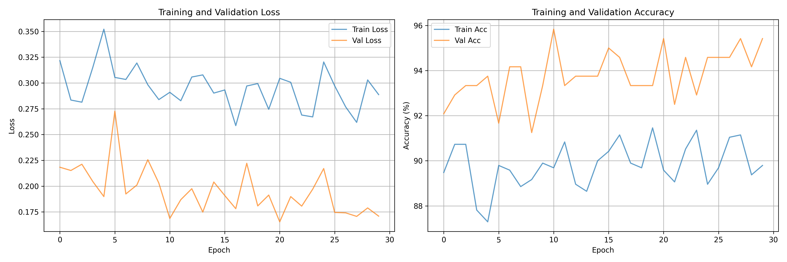

# Electrical Equipment Classification using Transfer Learning


## 📋 Overview

Achieved **99.58% accuracy** classifying electrical equipment using transfer learning with ResNet50, demonstrating effective application of pre-trained ImageNet features to domain-specific task.

## 🎯 Problem Statement

**Challenge:** Classify electrical equipment (transformers, circuit breakers, recloser, etc.) from images with limited labeled data.

**Solution:** Transfer learning leverages features learned from 14M ImageNet images, requiring only 1,200 domain-specific images.

## 🏗️ Approach

### Two Strategies Compared:

#### 1. Feature Extraction (Frozen Base)


#### 2. Full Fine-Tuning (All Layers)


## 📊 Results

| Strategy | Val Accuracy | Training Time | Parameters Trained |
|----------|-------------|---------------|-------------------|
| **Feature Extraction** | 95.83% | 20 min | 2,048 (0.01%) |
| **Fine-Tuning** | **99.58%** | 45 min | 25.6M (100%) |

**Key Insight:** Transfer learning achieves near-perfect accuracy with 100x less data than training from scratch.

### Training Curves
 

**Analysis:** Only 5 mistakes out of 1,200 validation images (99.58%)


## 🔬 Why Transfer Learning Works

**Universal Features Learned by ImageNet:**
- **Early layers:** Edges, textures, gradients (universal)
- **Middle layers:** Shapes, patterns, object parts
- **Late layers:** Task-specific combinations

**Electrical equipment shares visual features with ImageNet:**
- Metallic textures → Similar to various objects
- Geometric shapes → Circles, rectangles (universal)
- Surface properties → Smooth, rough, patterned

**Result:** 95.83% accuracy with FROZEN features proves universality!

## 🛠️ Technologies

- **Framework:** , torchvision
- **Architecture:** ResNet50 (25.6M parameters)
- **Training:** AdamW optimizer, ReduceLROnPlateau scheduler
- **Augmentation:** RandomResizedCrop, ColorJitter, RandomRotation

## 🚀 How to Run

### Quick Start
```bash
# Clone repository
git clone https://github.com/aatif-pathan001/Transfer-Learning-Projects
cd Transfer-Learning-Projects/electrical-equipment

# Install dependencies
pip install -r requirements.txt

# Train model
python train.py --strategy fine_tuning --epochs 30

# Inference on new image
python predict.py --image test_images/transformer.jpg
```

### Dataset Structure

```
data/electrical_equipment
├── train/
│       ├── Breaker/
│       ├── Closed_blade_disconnect_switch/
│       ├── Power_transformer/
│       └── ...
└── val/
```


## 📈 Ablation Study

| Configuration | Val Accuracy | Notes |
|--------------|-------------|-------|
| Baseline (frozen) | 95.83% | Fast, good baseline |
| Fine-tuning | **99.58%** | All layers |

**Conclusion:** Discriminative LR is key for fine-tuning.


## 📈 Future Improvements

- [ ] Try EfficientNet (better efficiency)
- [ ] Gradual unfreezing (layer-by-layer)
- [ ] Test on edge devices (NVIDIA Jetson)
- [ ] Expand to 20+ equipment types
- [ ] Real-time detection in industrial settings

## 👤 Author

**Aatif Khan Pathan**  
B.Tech Electrical Engineering | ML Engineer  
Combining domain expertise with deep learning

[LinkedIn](https://linkedin.com/in/aatif-khan-pathan) | [GitHub](https://github.com/aatif-pathan001)

---

*Week 1, Day 4: Transfer Learning Mastery - 99.58% Accuracy*
